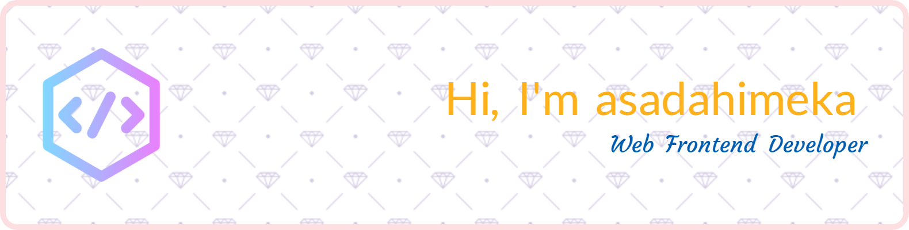

<!--
### Hi there 👋
**asadahimeka/asadahimeka** is a ✨ _special_ ✨ repository because its `README.md` (this file) appears on your GitHub profile.

Here are some ideas to get you started:

- 🔭 I’m currently working on ...
- 🌱 I’m currently learning ...
- 👯 I’m looking to collaborate on ...
- 🤔 I’m looking for help with ...
- 💬 Ask me about ...
- 📫 How to reach me: ...
- 😄 Pronouns: ...
- ⚡ Fun fact: ...
-->

- 👨‍💻 All of my projects are available at [Repositories](https://github.com/asadahimeka?tab=repositories&q=&type=public&language=&sort=stargazers)
- 📝 I regularly write articles on [https://www.nanoka.top](https://www.nanoka.top)
- 📫 How to reach me **i[at]nanoka.top**

<h3 align="left">Connect with me:</h3>

<h3 align="left">Languages and Tools:</h3>

  
  
  
  
  
  
  
  
  
  
  
  
  
  
  
  
  
  
  
  
  
  
  
  
  
  
  
  

<h3 align="left">GitHub Stats:</h3>

